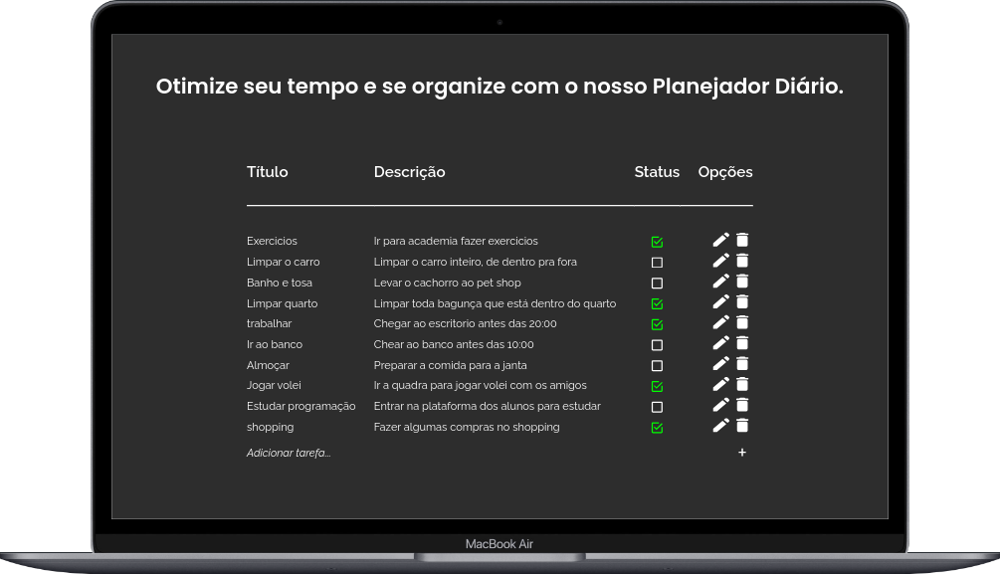
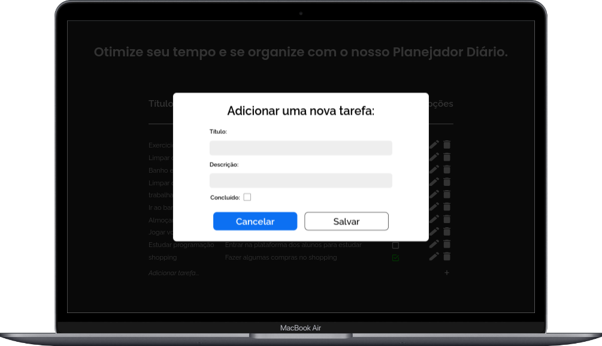
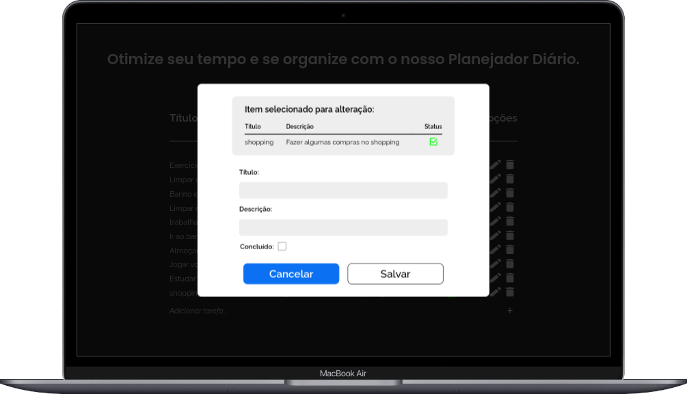
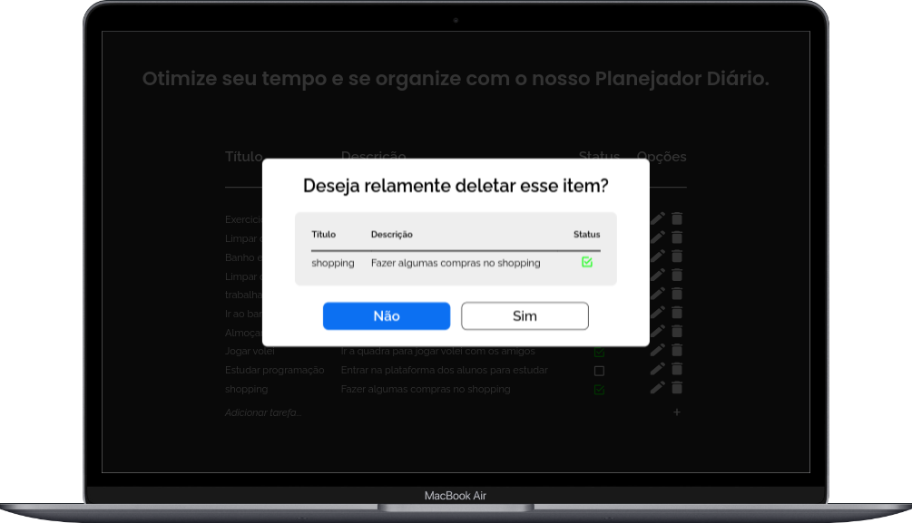
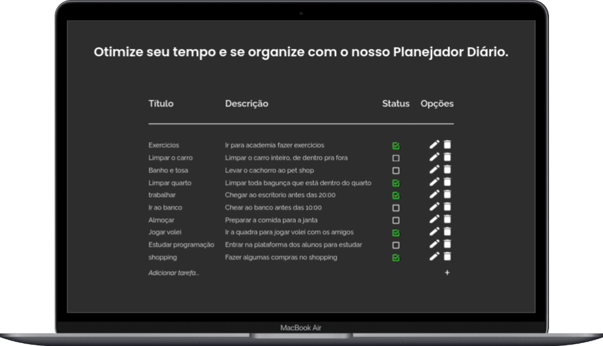

<h1 align="center"> TODO LIST </h1>

<p align="center">
Projeto todo list tem como objetivo facilitar a listagem de tarefas de uma forma intuitiva e fácil, organizando seus afazeres do dia! <br/>
</p>

<p align="center">
  <a href="#funcionalidades">Funcionalidades</a>&nbsp;&nbsp;&nbsp;|&nbsp;&nbsp;&nbsp;
  <a href="#tecnologias">Tecnologias</a>&nbsp;&nbsp;&nbsp;|&nbsp;&nbsp;&nbsp;
   <a href="#estrutura-do-projeto">Estrutura do Projeto</a>&nbsp;&nbsp;&nbsp;|&nbsp;&nbsp;&nbsp;
  <a href="#rodando-localmente">Rodando Localmente</a>
  
</p>

<p align="center">
  
</p>

<p align="center">
  
</p>

## Funcionalidades

#### Modal Dinâmico

- Para toda tomada de decisão é feita a chamada de um modal dinâmico, seja para adicionar, alterar ou excluir uma tarefa.
<p align="center">
  
  
  
</p>

#### Apenas um clique

- Alterar de tarefa a fazer para concluída com um clique, ou vice e versa.

 <p align="center">
  
</p>

## Tecnologias

<p align="left">
   
   
   
   
   
  
</p>

## Estrutura do projeto

- `./src/components` - São todos os pedaços essenciais para execução das interfaces

- `./src/view` - Páginas que serão executadas e mostradas ao usuário final.

- `./src/App.jsx` - Contém as rotas do projeto.

  - A rotas traz a execução do modal de forma dinâmica, trazendo um código mais limpo e de melhor perfomance:

  ```jsx
  <Route path="/" element={<Home list={list} reloadList={handleReoladList} />}>
  	<Route
  		path="add"
  		element={<TaskAdd list={list} reloadList={handleReoladList} />}
  	/>
  	<Route
  		path="edit/:id"
  		element={<TaskEdit list={list} reloadList={handleReoladList} />}
  	/>
  	<Route
  		path="delete/:id"
  		element={<TaskDelete list={list} reloadList={handleReoladList} />}
  	/>
  </Route>
  ```

## Rodando localmente

Certifique-se de quem todos requisitos necessários para execução do projeto de forma local.

#### setup ambiente

- [Node LTS](https://nodejs.org/en)
  - `node -v` - Verifique se tem instalado na máqui

#### Siga os passos abaixo:

Clone o projeto:
`git clone https://github.com/felipedestro/dnc-todolist.git`

Acesse o diretorio
`cd dnc-todolist`

Instale as dependências
`npm install`

Inicie o servidor
`npm run dev`

---

<p align="center">
  Feito por Felipe Destro 👋 <a href="https://github.com/felipedestro">Conheça meus projetos!</a>
</p>
